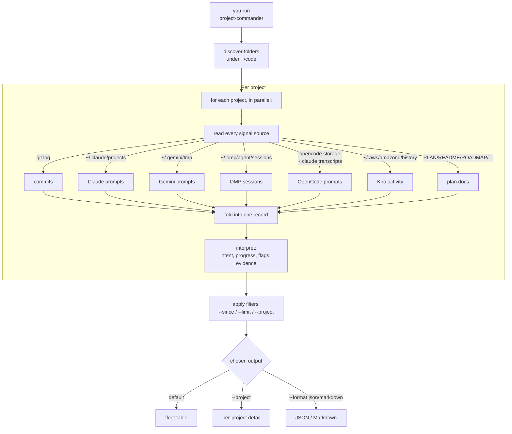

# Architecture

`project-commander` answers one question: **what is the state of every
project in `~/code` right now?**

It does that by reading every place a project leaves a trail — git
history, agent conversation logs across seven coding tools, and plan
docs in the repo itself — and folding all of it into one record per
project, then rendering that record in whichever shape you asked for.

This document describes what the tool gives you and how it produces
each piece. For module-level internals, read the source.

## What you get

Three views, same underlying data, different shapes.

### Fleet table (default)

```
$ project-commander
```

One row per project. Six columns:

| Column | What it tells you |
|---|---|
| **Project** | Folder name under `~/code`. |
| **Last active** | Time since the most recent observed event from any source ("0m ago", "13h ago", "4w ago"). |
| **Progress** | One of eleven lifecycle states (see below). The headline answer to *"is this thing alive?"*. |
| **Sources** | One letter per tool that has touched this project: `G`it, `C`laude, ge`M`ini, `O`MP, opencode (`P`), `K`iro, `D`ocs. `CDMGOP` means six tools have history here. |
| **Git** | Branch + dirty marker (`*`). Dash if not a git repo. |
| **Intent** | One sentence: what the project is *for* + what it's *currently doing*. |

Sorted by recency. Ideal for *"which projects have I touched recently
and what was I doing?"* at a glance.

### Project detail (`--project <name>`)

```
$ project-commander --project cdda_improved
```

Full audit trail for one project: progress summary with concrete
numbers, the highest-priority plan doc's purpose, the most recent
substantive prompt as focus, last action, flags, evidence, 7d/30d
activity counts, then the actual recent commits, prompts, sessions,
and plan-doc edits.

Use this when the table tells you something interesting and you want
the receipts.

### Machine-readable (`--format json`, `--format markdown`)

Same data, structured for scripting or for sharing as a static
report. JSON includes both the interpreted `observations` block and
the raw `signals` array, so downstream tools can reinterpret if
desired.

## The seven signals it fuses

Each source contributes a different layer of evidence:

| Source | Where it reads | What it contributes |
|---|---|---|
| **git** | The repo itself | Branch, dirty flag, last 10 commits with subjects + timestamps. The objective record of what was committed. |
| **Claude Code** | `~/.claude/projects/<encoded-cwd>/*.jsonl` | User prompts you typed at Claude in this directory. The *intent* signal — what you asked for, in your own words. |
| **Gemini CLI** | `~/.gemini/tmp/<basename>/{logs.json,chats/}` | Prompts and chats from Gemini sessions. |
| **Oh-My-Pi** | `~/.omp/agent/sessions/-code-<name>/*.jsonl` | OMP harness session prompts. |
| **OpenCode** | `~/.local/share/opencode/storage/` joined with `~/.claude/transcripts/` | OpenCode session history; identifies which session belongs to which working directory and pulls the prompts back. |
| **Kiro / Amazon Q** | `~/.aws/amazonq/history/chat-history-<md5(abspath)>.json` | Kiro chat-history file mtime as activity signal. |
| **Docs** | `PLAN.md`, `README.md`, `ROADMAP.md`, `NEXT_STEPS.md`, `IMPROVEMENTS.md`, `AGENTS.md`, `CLAUDE.md`, `GEMINI.md`, `TODO.md` in the project | The *purpose* signal — what the project is for, and (via mtime + done-phrase detection) whether the plan is current. |

Together they answer questions no single tool can: *"this folder has
no git history but I clearly worked on it yesterday"* (laffer-lore,
OMP-only) or *"the README says shipped but I committed five times
since then"* (best_practices, drift detected via doc mtime + git
log).

## Intent: purpose + focus

The `Intent` cell on the table is composed from two layers:

- **Purpose** — what the project is *for*. Pulled from the
  highest-authority plan doc the project carries, in this order:

  ```
  PLAN.md > README.md > ROADMAP.md > NEXT_STEPS.md >
  IMPROVEMENTS.md > AGENTS.md > CLAUDE.md / GEMINI.md > TODO.md
  ```

  The first prose paragraph of that file becomes the purpose.

- **Focus** — what the project is *currently doing*. Distilled from
  the most recent substantive user prompt within 30 days, across
  every coding tool. "Substantive" excludes procedural one-liners
  (`yes`, `proceed`, `ok`, `next`, `continue`, `go`, …) — those are
  surfaced separately as a flag, not as focus.

Combined: `"<purpose> Currently: <focus>"`. Either side can be
missing; the renderer falls back gracefully.

## Progress: where the project is in its lifecycle

Eleven states, one per project, computed from activity windows + plan
state + dirty tree:

| State | Means |
|---|---|
| **Hot** | Touched today, with both prompts and commits in the last 7d. Active development. |
| **Active** | Touched within 7 days. |
| **Paused** | 7–30 days quiet, but mid-flight (uncommitted work or unresolved recent prompts). |
| **Cooling** | 7–30 days quiet, clean tree, low cadence. Slowing down naturally. |
| **Idle** | 30–90 days quiet. |
| **Dormant** | 90+ days quiet. |
| **Shipped** | Recent commits, plan declares complete, no fresh prompts. Properly landed. |
| **Drifting** | ⚠ Plan declares complete *but* commits keep landing. Either the plan is stale or you forgot you said you were done. |
| **Tracking** | Only upstream-style activity (sync commits, no prompts). Mirror or fork. |
| **Stub** | Documentation only — no commits, no prompts. |
| **Empty** | No signals observed for this folder. |

Each state ships with a one-line summary that names concrete numbers,
e.g. *"Touched today across 5 day(s); 10 commit(s), 12 prompt(s) this
week."*

The states are sized so the histogram is informative: an active dev
can expect a healthy spread across Hot/Active/Paused/Idle, with
Drifting and Empty as outliers worth investigating.

## Flags: things worth your attention

Flags surface conditions you'd otherwise have to spot manually:

| Flag | Triggers when | Why you care |
|---|---|---|
| `dirty-tree` | Working tree has uncommitted changes. | Work in flight you haven't captured. |
| `plan-drift` | Plan doc says "completed" + commits exist after the doc's mtime. | The plan is lying. |
| `tool-cluster` | ≥4 different tools have touched the project. | This is a "main" project — multiple agents converge here. |
| `upstream-only` | Commits exist on a non-main branch with no prompts at all. | Tracking-style fork. |
| `no-docs` | Project has no plan doc in any of the recognized names. | No durable record of intent. |
| `procedural-prompts` | Every recent prompt is `yes` / `proceed` / `ok` / etc. | You're approving an agent rather than directing one. Useful signal, not a defect. |
| `prompt-injection-detected` | Recent prompts match system-prompt-extraction patterns. | Someone tried to probe an agent's instructions on this project. |

## Evidence: every claim is auditable

The detail view always ends with a one-line `Evidence:` trail like:

```
Evidence: doc:PLAN.md; recent prompt within 0d; last action: git:commit;
          plan-drift: doc says complete, 5 commits since
```

Every interpreted line in the report can be traced back to the
specific signals that justified it. If the headline says *Drifting*,
the evidence says *which* doc, *which* phrase triggered it, and *how
many* commits came after.

## How a report is produced

End to end, when you run `project-commander`:



Three things to know about how the pipeline behaves:

- **Reads from disk every run.** No cache, no daemon, no database. If
  the report changes, something on disk changed. Reproducible by
  construction.
- **Heuristics, not LLMs.** All intent and progress detection is rule-
  based — fast, deterministic, free, offline. Same input on the same
  filesystem yields the same report.
- **One bad source can't break a report.** Per-source and per-project
  failures are caught and reported as a single failure row instead of
  taking down the whole run. A malformed JSONL file from one tool
  won't hide what the others observed.

## What you can ask for

```
project-commander                        all projects, sorted by recency
project-commander --since 7              only projects active in the last week
project-commander --limit 20             only the 20 most-recent
project-commander --project cdda_*       detail view for matching folders
project-commander --exclude pi-*         hide noisy folders
project-commander --format json          structured output
project-commander --format markdown      shareable report
project-commander --disable kiro         skip a source you don't use
project-commander --root /other/path     scan somewhere other than ~/code
```

`--project` and `--exclude` accept basename globs and repeat. `--disable`
takes one source per flag and repeats. Everything else is a single
value.

## Adding a new source

If you adopt a new coding tool, you can teach `project-commander` to
read it without touching anything else.

1. Drop a file under `src/project_commander/sources/` that knows how
   to read that tool's storage and emits one observation per event.
2. Each observation declares its `kind` (commit / prompt / doc /
   session / filesystem) so the renderer knows how to slot it.
3. Wire the new source into the CLI's scanner list and pick a
   single-letter flag for the table's `Sources` column.

The fleet table, detail view, and observations layer pick up the new
source automatically — they group by source and kind without caring
which tools are present.
