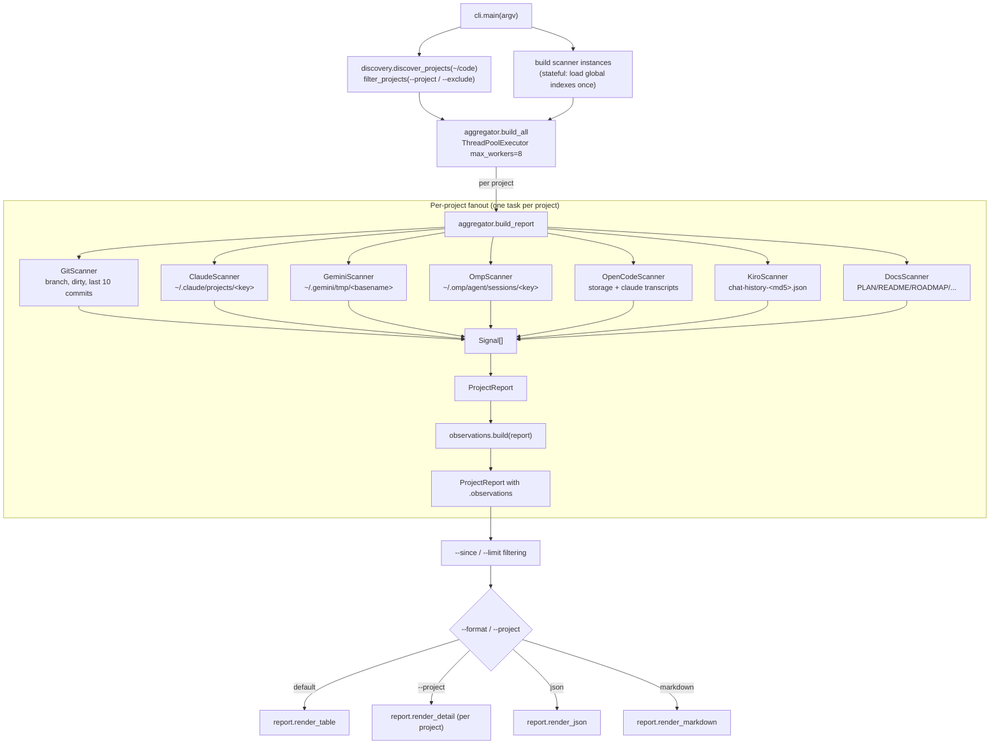

# Architecture

`project-commander` is a single-process Python CLI that fans out a small
fixed set of read-only scanners across every project under `~/code`,
fuses their output into one record per project, runs heuristics over the
fused record, and renders the result.

The whole tool is ~1.8K LOC. It has no daemon, no database, no cache
file, and one runtime dependency (`rich`). Every report run reads the
filesystem from scratch.

## The three data shapes

```
Signal         per-observation, one source              models.Signal
   │           kind ∈ {commit, prompt, doc, session, filesystem}
   │           timezone-aware UTC enforced in __post_init__
   ▼
ProjectReport  per-project, all signals folded in       models.ProjectReport
   │           branch, dirty flag, signals[], last_active
   ▼
Observations   per-project, interpreted                 observations.Observations
               progress enum, intent text, flags, evidence,
               7d/30d/90d activity windows
```

Three layers, three responsibilities:

| Layer | Reads | Produces | Has business logic? |
|---|---|---|---|
| **Sources** (`sources/*.py`) | Disk (git, JSON, markdown, etc.) | `list[Signal]` | No — only parsing |
| **Aggregator** (`aggregator.py`) | Source output | `ProjectReport` + `Observations` | Just orchestration |
| **Observations** (`observations.py`) | `ProjectReport` | `Observations` | Yes — all heuristics live here |
| **Renderer** (`report.py`) | `ProjectReport.observations` | Stdout | No — interprets nothing |

Heuristics live in exactly one place. The renderer reads observations
and prints them; it never decides what state a project is in.

## Runtime task graph



The `ThreadPoolExecutor` parallelizes **across projects**, not across
scanners. Each project runs its 7 scanners sequentially inside one
worker. This keeps the scanner protocol trivial (synchronous `scan`)
and the fanout shape easy to reason about: ~90 projects × 7 scanners
becomes 8 concurrent project-tasks.

_SRC_FLAGS

## Module layout

```
src/project_commander/
├── cli.py            argparse, default config, scanner construction, dispatch
├── discovery.py      walk ~/code, basename glob filter
├── paths.py          per-tool cwd → session-key translations (pure functions)
├── models.py         Signal (frozen, UTC-enforced), ProjectReport
├── aggregator.py     build_report, build_all (threadpool fanout)
├── observations.py   Progress enum, ActivityWindow, build(), heuristics
├── report.py         render_table / render_detail / render_json / render_markdown
└── sources/
    ├── base.py       SourceScanner protocol (just `scan(project) -> list[Signal]`)
    ├── git.py        subprocess git log
    ├── claude.py     ~/.claude/projects/<key>/*.jsonl
    ├── gemini.py     ~/.gemini/tmp/<basename>/{logs.json,chats/}
    ├── omp.py        ~/.omp/agent/sessions/<key>/*.jsonl
    ├── opencode.py   ~/.local/share/opencode + ~/.claude/transcripts join
    ├── kiro.py       ~/.aws/amazonq/history/chat-history-<md5(abspath)>.json
    └── docs.py       in-tree PLAN/README/ROADMAP/NEXT_STEPS/AGENTS/...
```

## Source scanner pattern

Every scanner satisfies one tiny protocol (`sources/base.py`):

```python
class SourceScanner(Protocol):
    name: str
    def scan(self, project: Path) -> list[Signal]: ...
```

There are two flavors of scanner:

1. **Stateless per-call.** `GitScanner`, `DocsScanner` — they only need
   the project path; they ask the filesystem directly each time.

2. **Stateful (global index, dispatch by project).** `OpenCodeScanner`
   has to read `storage/directory-readme/ses_*.json` once to learn
   which session belonged to which working directory, then return the
   matching prompts from `~/.claude/transcripts/ses_*.jsonl`. State is
   built in `__init__` (lazily on first scan) so the per-project call
   stays cheap.

### Per-tool path-key translations

Each agent tool has its own scheme for turning a working directory
into a session-storage directory name. Those translations live in
`paths.py`:

| Tool | Convention | Translation |
|---|---|---|
| Claude Code | `/` → `-` on absolute path | `paths.claude_key(p)` |
| Oh-My-Pi | strip `$HOME`, then `/` → `-` | `paths.omp_key(p, home)` |
| Gemini CLI | basename only (collisions possible) | `paths.gemini_key(p)` |
| Kiro / Amazon Q | `md5(absolute path)` | `paths.kiro_hash(p)` |
| OpenCode | indirect — session JSON records `cwd` | (no key fn; JSON lookup) |

Isolating those rules in one module is the difference between *"oh
right, that one's md5"* showing up once and showing up scattered
through three scanners.

## Observations heuristics

`observations.build(report)` is pure: same `ProjectReport` in, same
`Observations` out (modulo `now`, which is parameterizable for tests).
It runs in this order:

1. **Activity windows.** Count commits / prompts / sessions /
   distinct-active-days at 7d, 30d, 90d.
2. **Plan-drift detection.** Pick the highest-authority plan doc
   (`_DOC_AUTHORITY`: PLAN > README > ROADMAP > NEXT_STEPS >
   IMPROVEMENTS > AGENTS > CLAUDE/GEMINI > TODO). If its summary
   matches `_DONE_PHRASES` *and* commits exist after the doc's mtime,
   record the post-doc commit count.
3. **Compose intent.** `purpose` from the best doc; `focus` from the
   most recent non-procedural prompt within 30 days. Procedural
   prompts (`yes`, `proceed`, `ok`, ...) are filtered through
   `_PROCEDURAL_RE`; if all 30d prompts are procedural, the
   `procedural-prompts` flag fires.
4. **Classify progress.** Decision tree over the windows + drift +
   dirty tree, returning one of the eleven `Progress` states. Each
   state has a templated one-line summary that names concrete numbers
   (`"Touched today across 5 day(s); 10 commit(s), 12 prompt(s) this
   week."`).
5. **Compute flags.** `dirty-tree`, `plan-drift`, `tool-cluster` (≥4
   sources), `upstream-only` (commits with no prompts on a non-main
   branch), `no-docs`, `procedural-prompts`,
   `prompt-injection-detected` (prompts matching system-prompt-
   extraction patterns).
6. **Build evidence.** A short ordered list of the signals that
   justify each claim (`doc:PLAN.md; recent prompt within 0d; last
   action: git:commit; plan-drift: doc says complete, 5 commits
   since`). Every line in the rendered detail view can be traced back
   to a real signal here.

## Renderer dispatch

`cli.main` decides which renderer to call based on flags. There are
four entry points in `report.py`:

| Flag | Function | Output |
|---|---|---|
| (default) | `render_table(reports, console)` | `rich` table — Project / Last active / Progress / Sources / Git / Intent |
| `--project <glob>` | `render_detail(report, console)` (per match) | Multi-line block per project: progress summary, purpose, focus, last action, flags, evidence, activity stats, recent commits + prompts + sessions + plan docs |
| `--format json` | `render_json(reports)` | One JSON list. Each entry has the full `observations` block and the raw `signals` array |
| `--format markdown` | `render_markdown(reports)` | Markdown table mirroring the default view |

The detail view is the only renderer that walks the raw signal list;
it sorts and slices `report.recent(...)` per `kind` to produce the
"Recent commits / prompts / sessions / plan docs" sub-sections.

## Adding a new source

1. Create `src/project_commander/sources/<name>.py`. Implement a class
   with `name: str` and `scan(self, project: Path) -> list[Signal]`.
2. If the tool encodes the project path as a session-dir name, add the
   translation to `paths.py` and import it from the scanner — do not
   inline the rule.
3. Wire it into `cli.py`: add it to the `--disable` choices and append
   an instance to `scanners` in `main`.
4. _SRC_FLAGS
5. Emit signals with `kind` chosen from the existing literal union
   (`commit`, `prompt`, `doc`, `session`, `filesystem`). Adding a new
   kind is a model change and forces every reader to think about how
   to handle it — which is the point.

The aggregator, observations layer, and renderer pick up the new
source automatically — they iterate over `report.signals` and group
by `(source, kind)`.

## What this design buys

- **One place to interpret signals.** When a heuristic looks wrong, you
  fix it in `observations.py`, not in three render paths.
- **Audit trail by construction.** `Observations.evidence` is a list
  of strings the heuristic functions appended as they ran. The detail
  view prints it verbatim, so the report can always answer *"why did
  you say that?"*.
- **Cheap to add a tool.** A new source is one file plus a one-line
  wiring change, because the ingestion contract (`Signal`) is
  deliberately small.
- **No persistent state.** Reproducible from disk. If the report
  changes between runs, something on disk changed — there is no
  cache to invalidate.
